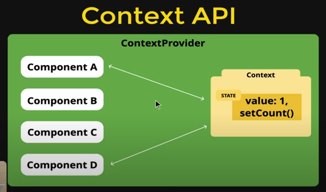

# Steps to initialize the context API:
1. Create the context
2. Provide the context
3. Consume the context in Child components

# Diagram for how it works

# contexts working
♦(TodoContext.js)Create context like this-
export const TodoContext = createContext({
    todos: [
        { 
            id: 1, 
            title: "First ToDo",
            completed: false 
        }],
        addTodo: (todo) => {},
        updateTodo: (id , todo) => {},
        deleteTodo: (id) => {},
        toggleComplete: (id) => {}
    ,
});
-functions not defined, will be defined in specific components
♦(TodoContext.js)export a function to use these contexts like this-

export const useTodo = () =>{
    return useContext(TodoContext)
}

♦(TodoContext.js)The wrapper that stores all these values/ library that stores all these values is-

export const TodoProvider=TodoContext.Provider;

♦(index.js)Export these contexts like-

export {TodoContext,TodoProvider,useTodo} from './TodoContext';

♦(app.jsx)Fetch the values like this-

<!--<TodoProvider value={{todos,addTodo,updateTodo,deleteTodo,toggleComplete}}>
      <h1>Hello World!</h1>
    </TodoProvider> -->

# Fastest boiler plate to initialize context API:
import { createContext, useContext } from "react";

export const ThemeContext = createContext({
    themeMode: "light",
    darkTheme: () => {},
    lightTheme: () => {},
})

export const ThemeProvider = ThemeContext.Provider

export default function useTheme(){
    return useContext(ThemeContext)
}

# Step that shows each step:
# UserContext.js
import React from "react";
const UserContext=React.createContext();
export default UserContext;
# UserContextProvider.jsx
import React, { useState } from "react";

import UserContext from "./UserContext";

const UserContextProvider = ({ children }) => {
  const [user, setUser] = useState(null);
  return (
    <UserContext.Provider value={{ user, setUser }}>
      {children}
    </UserContext.Provider>
  );
};

export default UserContextProvider;
